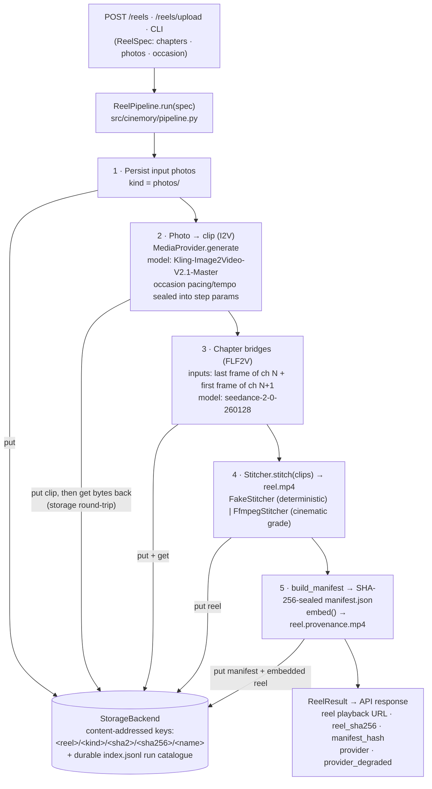
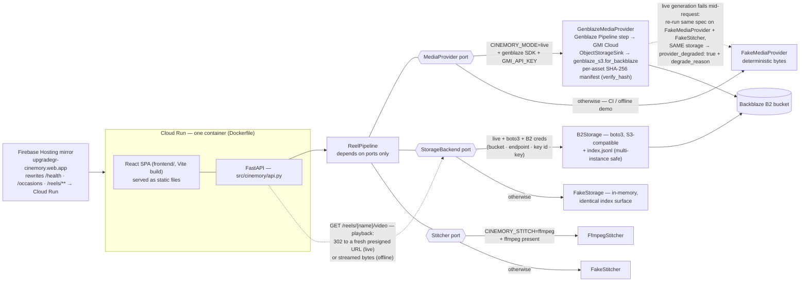

# Cinemory — your memories, made into film

> Turn a set of photos into a scored, cinematic video reel — generated with
> [Genblaze](https://github.com/backblaze-labs/genblaze), stored on
> [Backblaze B2](https://www.backblaze.com/cloud-storage), and sealed with
> verifiable SHA-256 **provenance** on every output.

Built for the [Backblaze Generative Media Hackathon](https://backblaze-generative-media.devpost.com/).

> **Canonical repo:** [github.com/upgradedev/cinemory](https://github.com/upgradedev/cinemory)
> (local working copy: `repos/cinemory`). Feature roadmap, opt-in connectors,
> show-stoppers and go-live steps: **[`ROADMAP.md`](ROADMAP.md)**.

## Live demo

- **Cloud Run:** https://cinemory-595784992266.europe-west1.run.app — the API
  (`/health`, `/occasions`, `POST /reels`) plus the React UI, running in
  **live mode** (`/health` reports the effective backends: `mode:"live"`,
  `provider:"genblaze"`, `storage:"B2Storage"`). Generation currently
  degrades honestly per request (`provider_degraded: true`) until the GMI
  account is topped up — see `deploy/DEPLOYED.md`.
- **Firebase mirror:** https://upgradegr-cinemory.web.app — the identical app.
- **Demo video:** [`demo/cinemory-demo.mp4`](demo/cinemory-demo.mp4) (2:58).
  YouTube link: *TODO(owner): paste the URL after upload.*

---

## Origin story

Cinemory began as a personal project: a video gift, made from photos, for a
wedding anniversary — memories turned into a short film scored to music. This
repository generalizes that idea into a production-shaped generative-media app.

**Privacy first, by construction.** The original anniversary content is private
and stays private. This public repo and its demo operate on **synthetic demo
memories only** — images generated programmatically at runtime
([`synthetic.py`](src/cinemory/synthetic.py)). No real personal photo or datum
is read, generated, or committed anywhere in this project. See
[PII safety](#pii-safety).

---

## What it does

Given a set of (synthetic) memories organised into *chapters*:

1. **Photo → clip** — each photo is animated into a short video via an
   image-to-video model (Genblaze step).
2. **Chapter bridges** — first-last-frame transitions smoothly connect scenes.
3. **Music-driven cuts** — scene changes can be planned onto musical beats.
4. **Stitch** — clips are assembled into one reel (deterministic offline, or a
   real ffmpeg cinematic colour-grade).
5. **Store on B2** — every input, clip, the final reel, and the run manifest are
   written to Backblaze B2 under content-addressed keys.
6. **Provenance** — a SHA-256-sealed manifest records provider, model, prompt,
   params, timestamps and every asset hash; it is persisted to B2 *and* embedded
   into the reel container, and can be re-verified at any time.



---

## Architecture



**API endpoints:** `GET /health` · `GET /occasions` · `POST /reels` (synthetic
demo) · `POST /reels/upload` (real photos, base64 JSON) ·
`POST /reels/upload-multipart` (real photos, multipart) · `GET /reels/{name}`
(sealed manifest) · `GET /reels/{name}/video` (playback: 302 to a fresh
presigned B2 URL in live mode, streamed bytes offline — the stable
`playback_url` every reel response carries).

The orchestrator depends **only on ports** (`MediaProvider`, `StorageBackend`,
`Stitcher`). The real adapters wrap Genblaze and B2; the fakes implement the
same protocols with no network. The *same* pipeline code — including the real
hashing and provenance — runs in both modes, so CI is green with zero
credentials while the live path is a one-line adapter swap. In `live` mode the
real backends are used only when their credentials are present; otherwise the
API degrades transparently to the offline path, so `POST /reels` never 500s.

---

## How Backblaze B2 is used

- **Every artifact is persisted to B2**: synthetic input photos, each generated
  clip, chapter bridges, the final reel, the embedded-provenance reel, and the
  `manifest.json`.
- **Content-addressed layout** (`KeyStrategy.HIERARCHICAL`):
  `<reel>/<kind>/<sha2>/<sha256>/<name>` — identical bytes deduplicate by hash.
- **Data orchestration**: the storage backend keeps a queryable run index
  (JSONL catalogue of every object + size + content-type), the analogue of
  Genblaze's Parquet index sink — a catalogue you can query over your whole
  media library.
- B2 is S3-compatible, so the adapter ([`b2_storage.py`](src/cinemory/adapters/b2_storage.py))
  is a thin boto3 client; credentials come only from the environment.

## How Genblaze is used

Genblaze is **load-bearing**, not a dumb byte source. On the live path the
adapter ([`genblaze_provider.py`](src/cinemory/adapters/genblaze_provider.py))
lets Genblaze own generation *and* durable storage *and* provenance for every
generated asset:

- **Generation** is expressed as a real **Genblaze `Pipeline` step**
  (`Pipeline("cinemory-step").step(provider, model=, prompt=, modality=).run(...)`)
  — image-to-video, first-last-frame bridge, audio — behind the `MediaProvider`
  port.
- **Storage + provenance done *by* Genblaze:** the adapter attaches Genblaze's
  own `ObjectStorageSink` over a `genblaze_s3.S3StorageBackend.for_backblaze(...)`
  backend, so Genblaze downloads the model output, content-addresses it, persists
  it to **Backblaze B2**, and seals a **SHA-256 provenance manifest** for the run
  (`result.manifest.verify_hash()`).
- **Provenance chaining:** Cinemory reads the durable bytes back through the same
  backend and **verifies them against Genblaze's sealed SHA-256**, then folds
  that hash into its own reel-level manifest ([`provenance.py`](src/cinemory/provenance.py)).
  Genblaze owns per-asset provenance; Cinemory owns the composed-reel provenance.
- **Verified against the real SDK.** The adapter's every call and result shape is
  contract-tested against the *actual* published Genblaze SDK using its own
  shipped mock provider (`genblaze_core.testing`), so API drift fails CI —
  ([`tests/integration/test_genblaze_contract.py`](tests/integration/test_genblaze_contract.py)).
  `genblaze-core` is installed in CI (pure-Python, no credentials); only the live
  GMICloud generation and B2 writes need keys.
- **Provider port; GMI Cloud live today** — generation sits behind the
  `MediaProvider` port. Live generation currently supports the **GMI Cloud**
  provider via Genblaze ([`config.py`](src/cinemory/config.py) gates live
  readiness on it); other Genblaze providers (OpenAI, Google, Runway, Luma)
  are scaffolded in config and on the roadmap — the port design lets them
  slot in without touching the pipeline.

### AI providers & models

| Role | Default model (via Genblaze) | Provider |
|---|---|---|
| Photo → video (I2V) | `Kling-Image2Video-V2.1-Master` | GMI Cloud |
| Chapter bridge (FLF2V) | `seedance-2-0-260128` | GMI Cloud |
| Still generation (optional) | `seedream-5.0-lite` | GMI Cloud |

Models are configurable per pipeline. Live generation currently runs through
GMI Cloud; further Genblaze providers are on the roadmap.

---

## Occasions, sharing & opt-in connectors

Beyond the core pipeline, Cinemory adds distribution and personalization — the
core stays offline/PII-safe; the connectors are **opt-in and consent-gated**
(never in CI or the default demo). Full detail + go-live steps in
**[`ROADMAP.md`](ROADMAP.md)**.

- **Occasion themes** ([`occasions.py`](src/cinemory/occasions.py)) — six
  config-driven presets (anniversary, graduation, birthday, wedding,
  year-in-review, business-event/award-ceremony) that adjust scene labels,
  prompt direction, music mood, pacing and aspect ratio. Select via
  `--occasion`, `POST /reels` or `GET /occasions`; recorded in the sealed
  manifest. Add a theme = add one dict entry.
- **Web Share + export** ([`frontend/src/lib/share.ts`](frontend/src/lib/share.ts)) —
  native OS share sheet (`navigator.share({files})`) to Instagram / Facebook /
  LinkedIn / YouTube with **no platform API review**, plus a download button and
  per-platform deep-links.
- **Google Photos Picker** ([`connectors/google_photos.py`](src/cinemory/connectors/google_photos.py))
  — OAuth consent → Picker session → user hand-picks in Google's UI → poll →
  download picked bytes. (Library auto-curation is impossible since Google
  removed the read-scopes; the **pick** flow is the sanctioned path.)
- **YouTube upload** ([`connectors/youtube.py`](src/cinemory/connectors/youtube.py))
  + **LinkedIn share** ([`connectors/linkedin.py`](src/cinemory/connectors/linkedin.py))
  — implemented where the API allows; account-type/audit caveats in `ROADMAP.md`.

Every connector runs through an injectable HTTP transport seam, so the
multi-step flows are unit-tested offline with a fake transport — no network, no
credentials, no third-party import in CI. Enable the live path with
`pip install 'cinemory[connectors]'`.

**Not built (show-stoppers, see `ROADMAP.md`):** an Apple/iCloud *server*
connector (no third-party API exists — only a native iOS PhotoKit app; the
mobile `<input type=file>` already streams iCloud originals), and *personal*
Instagram/Facebook auto-posting (Graph API is Business/Creator-only — the
share-sheet covers it).

---

## Quickstart

### Offline (no credentials — this is what CI runs)

```bash
pip install -r requirements-dev.txt
pip install -e ".[server]"    # [server] brings uvicorn for the API step below

# Generate a reel end-to-end from synthetic photos and verify provenance:
python -m cinemory.cli --name demo --chapters 3 --per-chapter 2 --bridges --out out

# Run the API:
uvicorn cinemory.api:app --reload
# POST http://localhost:8000/reels   {"name":"demo","chapters":3,"per_chapter":2}
#
# Generate from REAL photos (mobile/web sends actual pixels):
#   POST /reels/upload            base64 JSON  {"name","occasion","chapters",
#                                               "photos":[{"filename","content_base64"}]}
#   POST /reels/upload-multipart  multipart/form-data files=@a.jpg files=@b.jpg …
```

> Reel generation always works with **no credentials**: in `live` mode the API
> uses the real Genblaze/B2 backends only when their credentials are present,
> and otherwise degrades transparently to the offline path (`GET /health`
> reports the effective `provider`/`storage`), so `POST /reels` never 500s.
> If the live provider fails mid-request, the reel is re-run on the offline
> provider against the same real storage and the response is labelled
> `provider_degraded: true` + `degrade_reason` — the manifest records the
> provider that actually generated the assets.

### Live (real Genblaze + Backblaze B2)

```bash
cp .env.example .env          # fill B2 + provider credentials
pip install -e ".[live]"
export CINEMORY_MODE=live
export CINEMORY_STITCH=ffmpeg # optional real cinematic grade (needs ffmpeg)
python -m cinemory.cli --name demo --chapters 3 --per-chapter 2
```

### Docker

```bash
docker build -t cinemory .
docker run -p 8000:8000 cinemory       # offline by default
```

---

## Testing & CI

A full testing pyramid runs offline (fakes for Genblaze + B2, no creds):

| Layer | Location | Proves |
|---|---|---|
| **Unit** | `tests/unit/` | provenance hashing/verify/tamper-detection, key strategy, synthetic photos, beat-cut planning, occasion presets, fakes |
| **Integration** | `tests/integration/` | pipeline wiring (photos→clips→bridges→reel), FastAPI routes (incl. `/occasions`, the `/reels/upload` ingest routes, and the credential-free `live`-mode degrade path), opt-in connector flows via a fake HTTP transport, real ffmpeg stitch (skipped if ffmpeg absent) |
| **E2E** | `tests/e2e/` | synthetic memories → reel → B2 → reload manifest → **assert on real SHA-256 the provenance layer recomputes** |
| **Pen-test** | `tests/security/` | app-security suite driving the real app: authZ/abuse (bounds → 4xx, never 5xx), injection/path-traversal into B2 keys, provenance forgery/tamper-evidence, sensitive-data exposure (incl. the offline-degrade path), SSRF/upload magic-byte validation |

```bash
pytest                 # whole pyramid
pytest tests/unit      # or a single layer
```

### Readiness gate

`scripts/readiness.py` is a machine-checkable submission gate: it scores the repo
against the four challenge criteria (**Real-World Utility · Production Readiness ·
B2 Storage & Orchestration · Use of Genblaze**) plus our own fifth,
**Application Security**, with **real-evidence** checks —
each one *drives the actual code path* (the API via `TestClient`, the pipeline,
the real B2 adapter against an in-memory S3 stub, the real Genblaze SDK), never a
file-existence stub. Each check is `pass` / `fail` / `user-gated` (a lift that
needs a human-held credential — a write-entitled B2 key, a `GMI_API_KEY`, a live
redeploy). It prints a per-criterion report, emits `readiness.json`, and **exits
non-zero when the automatable completeness drops below 95%** — so the `readiness`
CI job fails on any regression. User-gated items are excluded from the automatable
% and listed as the remaining live-credential lifts.

```bash
python scripts/readiness.py            # human report + readiness.json (exit 1 if < 95%)
```

The gate is itself covered end-to-end in `tests/e2e/test_readiness_gate.py`
(run out-of-process, as CI runs it).

### Security checks (all in CI, all offline)

- **Pen-test suite** — `tests/security/`, a `pen-test` CI job of real
  application-security assertions against the live FastAPI app / pipeline /
  adapters: authorization & abuse limits, injection / path-traversal into
  content-addressed B2 keys, provenance forgery / tamper-evidence, sensitive-data
  exposure (including the credential-free offline-degrade path), and SSRF / upload
  magic-byte validation. Mirrored as the gate's **Application Security** criterion.
- **gitleaks v8.18.4** — secret scan, fail-fast before build (`--redact`).
- **CodeQL** — SAST for `python` + `javascript-typescript`.
- **SCA/CVE gate** — `pip-audit --strict` (Python) + `npm audit` (frontend + web).
- **ruff** — lint.

```bash
pytest tests/security  # the pen-test layer, offline, no creds
```

See [`.github/workflows/ci.yml`](.github/workflows/ci.yml).

---

## PII safety

This is a hard rule of the project:

- The only input source is [`synthetic.py`](src/cinemory/synthetic.py) —
  deterministic, programmatically drawn images.
- No real personal media is read, generated, or committed. The private
  anniversary content that inspired Cinemory is **not** in this repo.
- `.gitignore` blocks common photo formats, a `private/` directory, and `.env`.
- CI runs a gitleaks secret scan on every push/PR.

---

## Project layout

```
src/cinemory/
  models.py        domain types (ReelSpec, Chapter, Bridge, Asset, ...)
  ports.py         MediaProvider · StorageBackend · Stitcher protocols
  pipeline.py      ReelPipeline orchestrator
  provenance.py    SHA-256 manifest: build · verify · embed · extract
  keys.py          content-addressed key strategies (B2 layout)
  stitch.py        FakeStitcher (offline) · FfmpegStitcher (real grade)
  music.py         beat-cut planning (pure) + optional librosa analysis
  synthetic.py     PII-safe synthetic photo generation
  ingest.py        build a ReelSpec from real uploaded photos (upload routes)
  occasions.py     config-driven occasion presets (themes)
  config.py        offline/live adapter selection (credential-aware degrade)
  api.py           FastAPI app
  cli.py           end-to-end CLI
  adapters/
    fake_provider.py · fake_storage.py     offline
    genblaze_provider.py · b2_storage.py   live
  connectors/      opt-in, consent-gated live integrations
    _http.py                      injectable HTTP transport seam
    google_photos.py              OAuth + Photos Picker flow
    youtube.py · linkedin.py      upload / share
frontend/          React SPA (Vite · TS) — the product UI; served by Firebase
                   Hosting AND the Cloud Run container (Dockerfile builds it)
web/               legacy TS browser client — Web Share reference impl; still
                   type-checked/built in CI, not served by the container
tests/             unit · integration · e2e
ROADMAP.md         features · show-stoppers · connector go-live steps
```

## License

MIT — see [LICENSE](LICENSE). Genblaze is MIT; Cinemory (the founder's own
product/brand) is reused here by concept and pattern, with synthetic data only.
