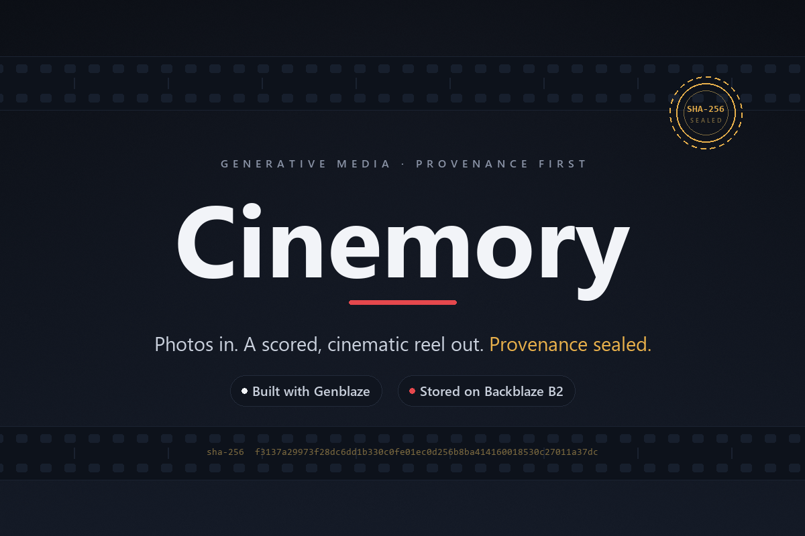
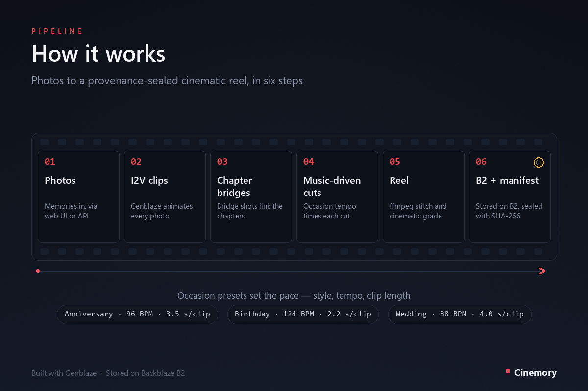
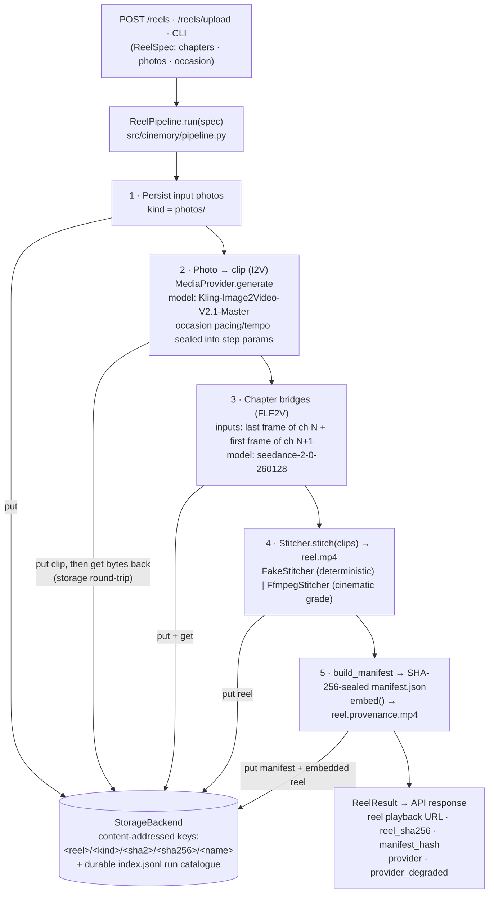
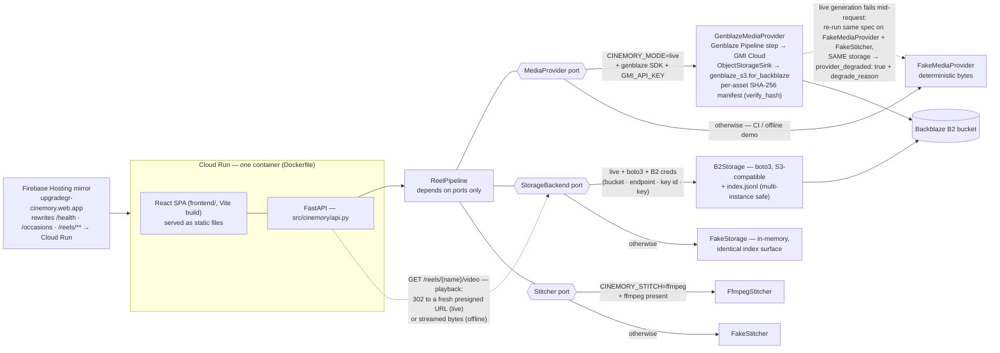
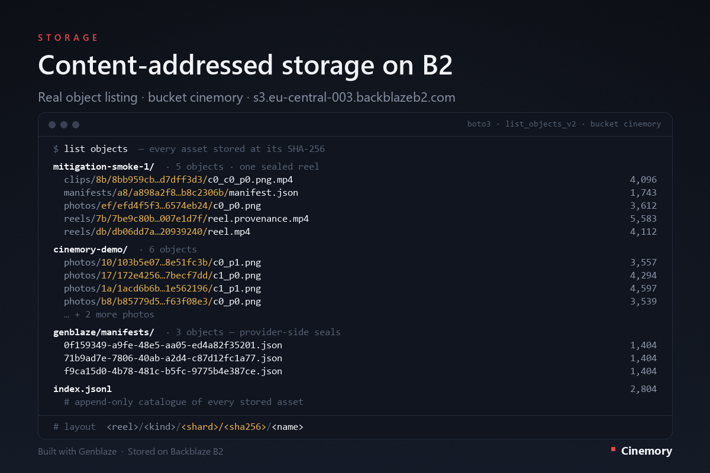

# Cinemory — your memories, made into film

> Turn a set of photos into a scored, cinematic video reel — generated with
> [Genblaze](https://github.com/backblaze-labs/genblaze), stored on
> [Backblaze B2](https://www.backblaze.com/cloud-storage), and sealed with
> verifiable SHA-256 **provenance** on every output.

Built for the [Backblaze Generative Media Hackathon](https://backblaze-generative-media.devpost.com/).



> **Canonical repo:** [github.com/upgradedev/cinemory](https://github.com/upgradedev/cinemory)
> (local working copy: `repos/cinemory`). Feature roadmap, opt-in connectors,
> show-stoppers and go-live steps: **[`ROADMAP.md`](ROADMAP.md)**.

## Live demo

- **Cloud Run:** https://cinemory-595784992266.europe-west1.run.app — the API
  (`/health`, `/occasions`, `POST /reels`) plus the React UI, running in
  **live mode** (`/health` reports the effective backends: `mode:"live"`,
  `provider:"genblaze"`, `storage:"B2Storage"`). **Real live generation is
  proven** (2026-07-22): 8 completed Kling renders (~242s avg) and a real
  h264 720p reel on B2, including a real generation on the live box's upload
  path — see `demo/STATE.md` + `deploy/DEPLOYED.md`.
- **Firebase mirror:** https://upgradegr-cinemory.web.app — the identical app.
- **Demo video:** [`demo/cinemory-demo.mp4`](demo/cinemory-demo.mp4) (2:34, of
  which 68.2s is live screen capture of this deployed app doing the real thing).
  YouTube link: *TODO(owner): paste the URL after upload.*

**Check that the live app really is this commit.** The image is stamped at
build time, so you can confirm the deployment matches what you are reading
here, without any access to the project:

```bash
curl -s https://cinemory-595784992266.europe-west1.run.app/health | jq .build
# {"commit": "<full sha>", "built_at": "<utc timestamp>"}
```

Compare `commit` against this repository's history. It is `null` for a build
that did not go through the deploy pipeline (a local run, or CI), which is the
honest answer rather than a guess.

---

## Verify it yourself

Every reel is sealed with a SHA-256 manifest, and the seal is not a "trust us"
claim — you can recompute it yourself, offline or in the browser.

**Offline, from the CLI** (no credentials needed):

```bash
pip install -r requirements-dev.txt && pip install -e .
python -m cinemory.cli --name demo --chapters 3 --per-chapter 2 --bridges --out out
```

```
...
verify manifest: True
verify asset:    True
verify embedded: True
```

Three independent checks, computed locally from the bytes written to disk: the
sealed manifest hash, the reel file's own SHA-256, and the manifest
re-extracted from *inside* the reel's video container.

**In the running app:** open a reel's Provenance panel and click **Verify** —
one click runs two independent checks in parallel. The browser re-fetches the
manifest and recomputes its SHA-256 itself with WebCrypto, so the seal isn't
taken on the server's word. At the same time, `GET /reels/{name}/verify`
re-fetches every stored artifact server-side and re-runs each named check,
returning a content-addressed receipt (its own digest seals the result). Two
different trust boundaries, same answer.

---

## Origin story

Cinemory began as a personal project: a video gift, made from photos, for a
wedding anniversary — memories turned into a short film scored to music. This
repository generalizes that idea into a production-shaped generative-media app.

**Privacy first, by construction.** The original anniversary content is private
and stays private. This public repo and its demo operate on **synthetic demo
memories only** — images generated programmatically at runtime
([`synthetic.py`](src/cinemory/synthetic.py)). No real personal photo or datum
is read, generated, or committed anywhere in this project. See
[PII safety](#pii-safety).

---

## What it does

Given a set of (synthetic) memories organised into *chapters*:



1. **Photo → clip** — each photo is animated into a short video via an
   image-to-video model (Genblaze step).
2. **Chapter bridges** — first-last-frame transitions smoothly connect scenes.
3. **Music-driven cuts** — scene changes can be planned onto musical beats.
4. **Stitch** — clips are assembled into one reel (deterministic offline, or a
   real ffmpeg cinematic colour-grade).
5. **Store on B2** — every input, clip, the final reel, and the run manifest are
   written to Backblaze B2 under content-addressed keys.
6. **Provenance** — a SHA-256-sealed manifest records provider, model, prompt,
   params, timestamps and every asset hash — and **cites each generated clip back
   to its source photo's SHA-256** (`source_sha256s`), so every output traces to
   the exact input it came from. It is persisted to B2 *and* embedded into the
   reel container, and can be re-verified at any time.


```mermaid
flowchart TD
    REQ["POST /reels · /reels/upload · CLI<br/>(ReelSpec: chapters · photos · occasion)"] --> RUN["ReelPipeline.run(spec)<br/>src/cinemory/pipeline.py"]
    RUN --> P1["1 · Persist input photos<br/>kind = photos/"]
    P1 --> P2["2 · Photo → clip (I2V)<br/>MediaProvider.generate<br/>model: Kling-Image2Video-V2.1-Master<br/>occasion pacing/tempo sealed into step params"]
    P2 --> P3["3 · Chapter bridges (FLF2V)<br/>inputs: last frame of ch N + first frame of ch N+1<br/>model: seedance-2-0-260128"]
    P3 --> P4["4 · Stitcher.stitch(clips) → reel.mp4<br/>FakeStitcher (deterministic) | FfmpegStitcher (cinematic grade)"]
    P4 --> P5["5 · build_manifest → SHA-256-sealed manifest.json<br/>embed() → reel.provenance.mp4"]
    P1 -- "put" --> B2
    P2 -- "put clip, then get bytes back<br/>(storage round-trip)" --> B2
    P3 -- "put + get" --> B2
    P4 -- "put reel" --> B2
    P5 -- "put manifest + embedded reel" --> B2
    B2[("StorageBackend<br/>content-addressed keys:<br/>&lt;reel&gt;/&lt;kind&gt;/&lt;sha2&gt;/&lt;sha256&gt;/&lt;name&gt;<br/>+ durable index.jsonl run catalogue")]
    P5 --> RES["ReelResult → API response<br/>reel playback URL · reel_sha256 · manifest_hash<br/>provider · provider_degraded"]
```

---

## Architecture


```mermaid
flowchart LR
    FB["Firebase Hosting mirror<br/>upgradegr-cinemory.web.app<br/>rewrites /health · /occasions · /reels/** → Cloud Run"] --> CR
    subgraph CR["Cloud Run — one container (Dockerfile)"]
        UI["React SPA (frontend/, Vite build)<br/>served as static files"] --- API["FastAPI — src/cinemory/api.py"]
    end
    API --> PIPE["ReelPipeline<br/>depends on ports only"]
    API -. "GET /reels/{name}/video — playback:<br/>302 to a fresh presigned URL (live)<br/>or streamed bytes (offline)" .-> SB
    PIPE --- MP{{"MediaProvider port"}}
    PIPE --- SB{{"StorageBackend port"}}
    PIPE --- ST{{"Stitcher port"}}
    MP -->|"CINEMORY_MODE=live<br/>+ genblaze SDK + GMI_API_KEY"| GEN["GenblazeMediaProvider<br/>Genblaze Pipeline step → GMI Cloud<br/>ObjectStorageSink → genblaze_s3.for_backblaze<br/>per-asset SHA-256 manifest (verify_hash)"]
    MP -->|"otherwise — CI / offline demo"| FMP["FakeMediaProvider<br/>deterministic bytes"]
    SB -->|"live + boto3 + B2 creds<br/>(bucket · endpoint · key id · key)"| B2S["B2Storage — boto3, S3-compatible<br/>+ index.jsonl (multi-instance safe)"]
    SB -->|"otherwise"| FS["FakeStorage — in-memory,<br/>identical index surface"]
    ST -->|"CINEMORY_STITCH=ffmpeg<br/>+ ffmpeg present"| FF["FfmpegStitcher"]
    ST -->|"otherwise"| FST["FakeStitcher"]
    GEN -. "live generation fails mid-request:<br/>re-run same spec on FakeMediaProvider + FakeStitcher,<br/>SAME storage → provider_degraded: true + degrade_reason" .-> FMP
    GEN --> B2[("Backblaze B2 bucket")]
    B2S --> B2
```

**API endpoints:** `GET /health` · `GET /occasions` · `POST /reels` (synthetic
demo) · `POST /reels/upload` (real photos, base64 JSON) ·
`POST /reels/upload-multipart` (real photos, multipart) · `GET /reels/{name}`
(sealed manifest) · `GET /reels/{name}/video` (playback: 302 to a fresh
presigned B2 URL in live mode, streamed bytes offline — the stable
`playback_url` every reel response carries) · `GET /reels/{name}/verify`
(re-verification receipt: re-fetches the manifest and every stored artifact and
re-runs each named provenance check from those bytes — the seal, the reel /
provenance-reel / per-clip hashes, embedded-manifest equality, source-photo
citations, and provider/model — returning an aggregate `verify_all` receipt whose
own digest content-addresses the receipt; the React ProvenancePanel renders it
live in the browser) · `POST /reels/jobs` (submit a generation as a
background job, 202 + `job_id`, see "Async generation" below) ·
`GET /reels/jobs/{job_id}` (poll a submitted job's status) ·
`GET /me/library` (a signed-in tenant's own reels, 401 for guest) ·
`DELETE /me/data` (erase a signed-in tenant's own data, 401 for guest; see
"Optional accounts" below).

**Product UI.** The React client opens on a landing page built for first-time
comprehension — a **How it works** walkthrough, a preview of sample source
photos (the kind you would upload, honestly labelled as input, not a
finished reel), and a one-click *"Try with sample photos"* path — before the
four-step wizard (Photos → Occasion → Generate → Result + Provenance).

The orchestrator depends **only on ports** (`MediaProvider`, `StorageBackend`,
`Stitcher`). The real adapters wrap Genblaze and B2; the fakes implement the
same protocols with no network. The *same* pipeline code — including the real
hashing and provenance — runs in both modes, so CI is green with zero
credentials while the live path is a one-line adapter swap. In `live` mode the
real backends are used only when their credentials are present; otherwise the
API degrades transparently to the offline path, so `POST /reels` never 500s.

---

## Async generation (submit + poll)

A real live render takes minutes (Kling I2V averages about 242 seconds per
clip), longer than the Firebase Hosting proxy allows and close to Cloud
Run's own request ceiling. Holding one HTTP request open that long is
fragile, so the API also exposes a non-blocking pair:

- `POST /reels/jobs` runs the same ingest validation as `POST
  /reels/upload`, writes a `queued` status object, starts the real
  generation in a background thread, and returns **202** with a `job_id`
  right away.
- `GET /reels/jobs/{job_id}` polls that status until it reaches a terminal
  value: `queued`, `running`, `done`, or `failed`. A `done` job carries the
  finished, sealed reel in its `result` field, the exact same shape the
  synchronous routes return.

Status lives in the same storage backend as everything else (B2 in live
mode, the in-memory fake offline), under `jobs/<job_id>/status.json`, so a
poll can be answered by any instance, not just the one that took the
submission. The frontend now submits and polls: every real-photo generation
goes through this pair (see [`src/cinemory/jobs.py`](src/cinemory/jobs.py)
and [`frontend/src/lib/queries.ts`](frontend/src/lib/queries.ts)). The
synthetic demo path (`POST /reels`, no uploaded photos) has no async
counterpart and stays a single blocking call.

**The job id is in the address bar.** As soon as a generation is submitted
the page rewrites its URL to `#reel/<job_id>` (`history.replaceState`, so
Back still means "leave"). Refreshing, closing the tab by accident, or coming
back tomorrow reopens the same run: still rendering, or finished, because the
job's stored status keeps its sealed result. A link whose id is malformed is
answered on the spot with no request; one that is simply unknown or expired
404s, which the poll treats as a final answer rather than a blip to retry.
Both land on the same plain "we couldn't find that reel" screen with a way
forward. No router library: the app already routed on
`window.location.hash`, so this stays dependency-free (see
[`frontend/src/lib/hash-route.ts`](frontend/src/lib/hash-route.ts)).

**How many photos, and how long.** Live generation is one image-to-video call
per photo, run sequentially, measured at **~314s per photo** on the deployed
service. The app polls a submitted job for at most **12 minutes**
(`REEL_JOB_MAX_POLL_MS`). Holding back 45s for sending the photos up,
stitching, storing and sealing, that leaves 675s of generation, so
`floor(675 / 314)` = **2 photos** per reel here. The cap is derived from those
numbers rather than typed in
([`frontend/src/lib/reel-budget.ts`](frontend/src/lib/reel-budget.ts)), the
UI shows the resulting estimate before and during the run, and a larger
selection is never silently shortened. It is a limit of this demo's waiting
window, not of the pipeline, which accepts up to 60 photos server-side.

**Honest limitation.** Polling can be answered from anywhere, but the
generation itself still runs in-process, on the one instance that accepted
the submit. There is no external queue and no separate worker fleet. A
client that keeps polling keeps that instance warm, so in practice the job
finishes, but if that specific instance were ever scaled down mid-job, the
in-flight generation would stop advancing with no automatic retry. This is
an accepted tradeoff for a demo, not a production job queue. A production
version would hand the work to a durable queue consumed by a Cloud Run
*Job* instead of a request-serving instance, so the work outlives any one
instance.

---

## Optional accounts (Google sign-in)

Sign-in is off by default and entirely opt-in. It turns on only when four
public build-time variables are set on the frontend (`VITE_FIREBASE_API_KEY`,
`VITE_FIREBASE_AUTH_DOMAIN`, `VITE_FIREBASE_PROJECT_ID`,
`VITE_FIREBASE_APP_ID`) and `FIREBASE_PROJECT_ID` is set on the backend.
Leave them unset, which is the current default for the live deployment, and
the app behaves exactly as it always has: no sign-in button renders, no "My
reels" library exists, and the Firebase SDK is never even fetched by the
browser (see [`frontend/src/lib/auth.ts`](frontend/src/lib/auth.ts)). Both
sets of variables are public configuration, the same values already visible
in any Firebase client bundle or browser network tab, never secrets.

When enabled, a visitor can sign in with Google. The backend verifies the
resulting Firebase ID token itself, against Google's public signing
certificates, with no Firebase Admin SDK and no service-account secret to
manage (see [`src/cinemory/auth.py`](src/cinemory/auth.py)). Every reel
route accepts an optional `Authorization: Bearer <token>` header; a verified
token scopes that request to a `tenants/<uid>/` storage prefix, so a
signed-in visitor's uploads and reels are isolated from every other visitor
and from guest data. The isolation is structural, not a check that could be
forgotten: a tenant's own index can only ever contain rows under its own
prefix, so a cross-tenant lookup finds nothing to return rather than being
rejected after the fact (see `_TenantScopedStorage` in
[`src/cinemory/api.py`](src/cinemory/api.py)). The tenant id itself always
comes from the verified token, never from anything the caller supplies.

Two routes give a signed-in visitor control over their own data:
`GET /me/library` lists everything they have generated, and `DELETE
/me/data` erases all of it in one call. Both return 401 for a guest. A
concurrency test drives several tenants (and guests) creating reels at the
same time and asserts the isolation still holds afterward, not just when
requests happen to be sequential
([`tests/integration/test_load.py`](tests/integration/test_load.py)).

---

## How Backblaze B2 is used

- **Every artifact is persisted to B2**: synthetic input photos, each generated
  clip, chapter bridges, the final reel, the embedded-provenance reel, and the
  `manifest.json`.
- **Content-addressed layout** (`KeyStrategy.HIERARCHICAL`):
  `<reel>/<kind>/<sha2>/<sha256>/<name>` — identical bytes deduplicate by hash.
- **Data orchestration**: the storage backend keeps a queryable run index
  (JSONL catalogue of every object + size + content-type), the analogue of
  Genblaze's Parquet index sink — a catalogue you can query over your whole
  media library.
- B2 is S3-compatible, so the adapter ([`b2_storage.py`](src/cinemory/adapters/b2_storage.py))
  is a thin boto3 client; credentials come only from the environment.



## How Genblaze is used

Genblaze is **load-bearing**, not a dumb byte source. On the live path the
adapter ([`genblaze_provider.py`](src/cinemory/adapters/genblaze_provider.py))
lets Genblaze own generation *and* durable storage *and* provenance for every
generated asset:

- **Generation** is expressed as a real **Genblaze `Pipeline` step**
  (`Pipeline("cinemory-step").step(provider, model=, prompt=, modality=).run(...)`)
  — image-to-video, first-last-frame bridge, audio — behind the `MediaProvider`
  port.
- **Storage + provenance done *by* Genblaze:** the adapter attaches Genblaze's
  own `ObjectStorageSink` over a `genblaze_s3.S3StorageBackend.for_backblaze(...)`
  backend, so Genblaze downloads the model output, content-addresses it, persists
  it to **Backblaze B2**, and seals a **SHA-256 provenance manifest** for the run
  (`result.manifest.verify_hash()`).
- **Provenance chaining:** Cinemory reads the durable bytes back through the same
  backend and **verifies them against Genblaze's sealed SHA-256**, then folds
  that hash into its own reel-level manifest ([`provenance.py`](src/cinemory/provenance.py)).
  Genblaze owns per-asset provenance; Cinemory owns the composed-reel provenance.
- **Verified against the real SDK.** The adapter's every call and result shape is
  contract-tested against the *actual* published Genblaze SDK using its own
  shipped mock provider (`genblaze_core.testing`), so API drift fails CI —
  ([`tests/integration/test_genblaze_contract.py`](tests/integration/test_genblaze_contract.py)).
  `genblaze-core` is installed in CI (pure-Python, no credentials); only the live
  GMICloud generation and B2 writes need keys.
- **Provider port; GMI Cloud live today** — generation sits behind the
  `MediaProvider` port. Live generation currently supports the **GMI Cloud**
  provider via Genblaze ([`config.py`](src/cinemory/config.py) gates live
  readiness on it); other Genblaze providers (OpenAI, Google, Runway, Luma)
  are scaffolded in config and on the roadmap — the port design lets them
  slot in without touching the pipeline.

### AI providers & models

| Role | Default model (via Genblaze) | Provider |
|---|---|---|
| Photo → video (I2V) | `Kling-Image2Video-V2.1-Master` | GMI Cloud |
| Chapter bridge (FLF2V) | `seedance-2-0-260128` | GMI Cloud |
| Still generation (optional) | `seedream-5.0-lite` | GMI Cloud |

Models are configurable per pipeline. Live generation currently runs through
GMI Cloud; further Genblaze providers are on the roadmap.

---

## Occasions, sharing & opt-in connectors

Beyond the core pipeline, Cinemory adds distribution and personalization — the
core stays offline/PII-safe; the connectors are **opt-in and consent-gated**
(never in CI or the default demo). Full detail + go-live steps in
**[`ROADMAP.md`](ROADMAP.md)**.

- **Occasion themes** ([`occasions.py`](src/cinemory/occasions.py)) — six
  config-driven presets (anniversary, graduation, birthday, wedding,
  year-in-review, business-event/award-ceremony) that adjust scene labels,
  prompt direction, music mood, pacing and aspect ratio. Select via
  `--occasion`, `POST /reels` or `GET /occasions`; recorded in the sealed
  manifest. Add a theme = add one dict entry.
- **Web Share + export** ([`frontend/src/lib/share.ts`](frontend/src/lib/share.ts)) —
  native OS share sheet (`navigator.share({files})`) to Instagram / Facebook /
  LinkedIn / YouTube with **no platform API review**, plus a download button and
  per-platform deep-links.
- **Google Photos Picker** ([`connectors/google_photos.py`](src/cinemory/connectors/google_photos.py))
  — OAuth consent → Picker session → user hand-picks in Google's UI → poll →
  download picked bytes. (Library auto-curation is impossible since Google
  removed the read-scopes; the **pick** flow is the sanctioned path.)
- **YouTube upload** ([`connectors/youtube.py`](src/cinemory/connectors/youtube.py))
  + **LinkedIn share** ([`connectors/linkedin.py`](src/cinemory/connectors/linkedin.py))
  — implemented where the API allows; account-type/audit caveats in `ROADMAP.md`.

Every connector runs through an injectable HTTP transport seam, so the
multi-step flows are unit-tested offline with a fake transport — no network, no
credentials, no third-party import in CI. Enable the live path with
`pip install 'cinemory[connectors]'`.

**Not built (show-stoppers, see `ROADMAP.md`):** an Apple/iCloud *server*
connector (no third-party API exists — only a native iOS PhotoKit app; the
mobile `<input type=file>` already streams iCloud originals), and *personal*
Instagram/Facebook auto-posting (Graph API is Business/Creator-only — the
share-sheet covers it).

---

## Quickstart

### Offline (no credentials — this is what CI runs)

```bash
pip install -r requirements-dev.txt
pip install -e ".[server]"    # [server] brings uvicorn for the API step below

# Generate a reel end-to-end from synthetic photos and verify provenance:
python -m cinemory.cli --name demo --chapters 3 --per-chapter 2 --bridges --out out

# Run the API:
uvicorn cinemory.api:app --reload
# POST http://localhost:8000/reels   {"name":"demo","chapters":3,"per_chapter":2}
#
# Generate from REAL photos (mobile/web sends actual pixels):
#   POST /reels/upload            base64 JSON  {"name","occasion","chapters",
#                                               "photos":[{"filename","content_base64"}]}
#   POST /reels/upload-multipart  multipart/form-data files=@a.jpg files=@b.jpg …
```

> Reel generation always works with **no credentials**: in `live` mode the API
> uses the real Genblaze/B2 backends only when their credentials are present,
> and otherwise degrades transparently to the offline path (`GET /health`
> reports the effective `provider`/`storage`), so `POST /reels` never 500s.
> If the live provider fails mid-request, the reel is re-run on the offline
> provider against the same real storage and the response is labelled
> `provider_degraded: true` + `degrade_reason` — the manifest records the
> provider that actually generated the assets.

### Live (real Genblaze + Backblaze B2)

```bash
cp .env.example .env          # fill B2 + provider credentials
pip install -e ".[live]"
export CINEMORY_MODE=live
export CINEMORY_STITCH=ffmpeg # optional real cinematic grade (needs ffmpeg)
python -m cinemory.cli --name demo --chapters 3 --per-chapter 2
```

### Docker

```bash
docker build -t cinemory .
docker run -p 8000:8000 cinemory       # offline by default
```

---

## Testing & CI

A full testing pyramid runs offline (fakes for Genblaze + B2, no creds):

| Layer | Location | Proves |
|---|---|---|
| **Unit** | `tests/unit/` | provenance hashing/verify/tamper-detection, key strategy, synthetic photos, beat-cut planning, occasion presets, fakes |
| **Integration** | `tests/integration/` | pipeline wiring (photos→clips→bridges→reel), FastAPI routes (incl. `/occasions`, the `/reels/upload` ingest routes, and the credential-free `live`-mode degrade path), opt-in connector flows via a fake HTTP transport, real ffmpeg stitch (skipped if ffmpeg absent) |
| **E2E** | `tests/e2e/` | synthetic memories → reel → B2 → reload manifest → **assert on real SHA-256 the provenance layer recomputes** |
| **Pen-test** | `tests/security/` | app-security suite driving the real app: authZ/abuse (bounds → 4xx, never 5xx), injection/path-traversal into B2 keys, provenance forgery/tamper-evidence, sensitive-data exposure (incl. the offline-degrade path), SSRF/upload magic-byte validation |

Measured on the latest green CI run on `main` (commit `2a41507`, 2026-08-02,
[run 30764058311](https://github.com/upgradedev/cinemory/actions/runs/30764058311)):
backend **315 passed + 4 skipped** across the `python` job's three tiers
(unit 156 passed + 1 skipped, integration 100 passed + 3 skipped, e2e 59
passed; the skips are environment-gated, optional-dependency or
live-credential tests that do not run without creds), pen-test suite (its
own `pen-test` CI job) **62 passed**, frontend **282 vitest tests across 39
files**.

```bash
pytest                 # whole pyramid
pytest tests/unit      # or a single layer
```

### Readiness gate

`scripts/readiness.py` is a machine-checkable submission gate: it scores the repo
against the four challenge criteria (**Real-World Utility · Production Readiness ·
B2 Storage & Orchestration · Use of Genblaze**) plus our own fifth,
**Application Security**, with **real-evidence** checks —
each one *drives the actual code path* (the API via `TestClient`, the pipeline,
the real B2 adapter against an in-memory S3 stub, the real Genblaze SDK), never a
file-existence stub. Each check is `pass` / `fail` / `user-gated` (a lift that
needs a human-held credential — a write-entitled B2 key, a `GMI_API_KEY`, a live
redeploy). It prints a per-criterion report, emits `readiness.json`, and **exits
non-zero when the automatable completeness drops below 95%** — so the `readiness`
CI job fails on any regression. User-gated items are excluded from the automatable
% and listed as the remaining live-credential lifts.

```bash
python scripts/readiness.py            # human report + readiness.json (exit 1 if < 95%)
```

The gate is itself covered end-to-end in `tests/e2e/test_readiness_gate.py`
(run out-of-process, as CI runs it).

### Security checks (all in CI, all offline)

- **Pen-test suite** — `tests/security/`, a `pen-test` CI job of real
  application-security assertions against the live FastAPI app / pipeline /
  adapters: authorization & abuse limits, injection / path-traversal into
  content-addressed B2 keys, provenance forgery / tamper-evidence, sensitive-data
  exposure (including the credential-free offline-degrade path), and SSRF / upload
  magic-byte validation. Mirrored as the gate's **Application Security** criterion.
- **gitleaks v8.18.4** — secret scan, fail-fast before build (`--redact`).
- **CodeQL** — SAST for `python` + `javascript-typescript`.
- **SCA/CVE gate** — `pip-audit --strict` (Python) + `npm audit` (frontend + web).
- **ruff** — lint.

```bash
pytest tests/security  # the pen-test layer, offline, no creds
```

See [`.github/workflows/ci.yml`](.github/workflows/ci.yml).

---

## PII safety

This is a hard rule of the project:

- Every demo input is machine-generated. Two sources, both non-real:
  [`synthetic.py`](src/cinemory/synthetic.py) (deterministic, programmatically
  drawn images — the default everywhere, including the tests and the app's
  *"Try with sample photos"* button), and
  [`sample-data/anniversary/`](sample-data/) (six AI-generated scene photos used
  as the demo video's input, made through Cinemory's own provider adapter; the
  people in them are **fictional and model-generated**, and none depicts or is
  meant to resemble a specific real individual). See
  [`sample-data/README.md`](sample-data/README.md).
- No real personal media is read, generated, or committed. The private
  anniversary content that inspired Cinemory is **not** in this repo.
- `.gitignore` blocks common photo formats, a `private/` directory, and `.env`,
  with a single deliberate exception for `sample-data/anniversary/*.jpg` above.
- CI runs a gitleaks secret scan on every push/PR.
- **Deploys carry no stored credential.** Once CI is green on `main`,
  `deploy-cloudrun.yml` builds and deploys the backend, then polls the live
  `GET /health` and **fails if `build.commit` is not the commit it just built**
  — a deploy is finished when the running app says so, not when `gcloud` exits
  0. It checks out the exact commit CI validated rather than whatever `main`
  points at by then, so the build stamp never names untested code. Auth is
  **Workload Identity Federation: no service-account key is stored in this
  repository.** The Google-side provider carries
  `assertion.repository=='upgradedev/cinemory'`, so the restriction is enforced
  by Google rather than by the workflow, which is what makes it safe in a
  public repo: a copy of the workflow elsewhere is rejected at the token
  exchange, not by a check someone could edit. The deploy identity holds seven
  roles and cannot enable APIs, create registries or alter secret IAM; those
  one-time steps are skipped in CI via `DEPLOY_SKIP_PROVISIONING`.

---

## Your photos and your data

The rule above covers this repo's own demo. A judge or user running the
live app for real, with their own photos, is a different question worth
answering plainly.

**What leaves the browser.** Uploaded photos are stored in the project's
private Backblaze B2 bucket, not public, and nothing is fetchable without a
signed URL. When the app is running in live mode (the deployed app is:
`GET /health` reports `storage:"B2Storage"`), the generation provider does
not receive raw photo bytes over the wire. Each source photo is persisted to
B2 first, and the provider fetches it itself through a presigned URL that
expires in an hour (`_external_inputs` in
[`src/cinemory/adapters/genblaze_provider.py`](src/cinemory/adapters/genblaze_provider.py)).
Running the offline quickstart, which is the default and needs no
credentials, never talks to B2 or any external provider at all: every
adapter is an in-memory fake.

**What does not happen.** No vision or text model looks at a photo to
describe it, and there is no captioning or image-understanding step
anywhere in the pipeline. The prompt behind each clip comes entirely from
the chosen occasion preset: a fixed rotation of camera-movement phrases
blended with that occasion's style
([`src/cinemory/ingest.py`](src/cinemory/ingest.py) and
[`occasions.py`](src/cinemory/occasions.py)), never from anything the
picture shows.

**Control.** A signed-in visitor can list everything they have generated
(`GET /me/library`) and delete all of it in one action (`DELETE /me/data`);
see "Optional accounts" above. Guests get the identical generation with no
account and nothing to sign into.

**Retention.** What the generation provider keeps afterward is governed by
that provider's own policy, not by this app. This project does not control
that and makes no guarantee about it.

---

## Project layout

```
src/cinemory/
  models.py        domain types (ReelSpec, Chapter, Bridge, Asset, ...)
  ports.py         MediaProvider · StorageBackend · Stitcher protocols
  pipeline.py      ReelPipeline orchestrator
  provenance.py    SHA-256 manifest: build · verify · embed · extract
  keys.py          content-addressed key strategies (B2 layout)
  stitch.py        FakeStitcher (offline) · FfmpegStitcher (real grade)
  music.py         beat-cut planning (pure) + optional librosa analysis
  synthetic.py     PII-safe synthetic photo generation
  ingest.py        build a ReelSpec from real uploaded photos (upload routes)
  occasions.py     config-driven occasion presets (themes)
  config.py        offline/live adapter selection (credential-aware degrade)
  api.py           FastAPI app
  cli.py           end-to-end CLI
  adapters/
    fake_provider.py · fake_storage.py     offline
    genblaze_provider.py · b2_storage.py   live
  connectors/      opt-in, consent-gated live integrations
    _http.py                      injectable HTTP transport seam
    google_photos.py              OAuth + Photos Picker flow
    youtube.py · linkedin.py      upload / share
frontend/          React SPA (Vite · TS) — the product UI; served by Firebase
                   Hosting AND the Cloud Run container (Dockerfile builds it)
web/               legacy TS browser client — Web Share reference impl; still
                   type-checked/built in CI, not served by the container
tests/             unit · integration · e2e
ROADMAP.md         features · show-stoppers · connector go-live steps
```

## License

MIT — see [LICENSE](LICENSE). Genblaze is MIT; Cinemory (the founder's own
product/brand) is reused here by concept and pattern, with synthetic data only.
